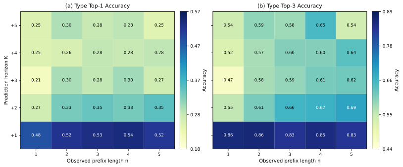

# Final MT-HTA

Final MT-HTA (Multi-Task Hierarchical Task-Attention Transformer) 是用於持拍運動下一拍事件預測的多任務架構。模型輸入目前預測點以前的擊球事件與比賽階層脈絡，同時輸出球種、正反手、落點及運動特有屬性。此 repository 支援 table tennis、badminton 與 tennis。

[查看 Final MT-HTA 架構圖（PDF）](<Final MT-HTA Architecture.pdf>)



## 方法概觀

資料依比賽規則組成多層歷史：

- **L1 Shot-level**：目前 rally 中、目標拍以前的 observed prefix。
- **L2 Rally-level**：目前 set 內已完成的 rallies。
- **L3 Set-level**：目前 set 以前已完成的 sets。
- **L4 Game-level（tennis）**：tennis 在 Rally 與 Set 之間加入已完成 games，形成 Shot -> Rally -> Game -> Set。

Final MT-HTA 使用兩條平行編碼路徑：

1. **Hierarchical Transformer path**：分層編碼 shot、rally、set；tennis 另編碼 game。
2. **Feature-token iTransformer path**：每個語意欄位是一個 token。各欄位先沿有效時間步做 padding-aware temporal projection，再於 feature tokens 之間做 self-attention，以建模 type、location、spin、score 等欄位交互。

兩條路徑在各階層以 sigmoid gate 融合。Final 設定再加入 shot-aware positional encoding、top-down attention、turn-based player-role routing 與最近一拍 gated skip connection。Task Attention Fusion 為每個預測任務學習獨立 query，從階層摘要與 hitter/opponent 表示擷取任務所需資訊。

## 論文結果

以下為 original table tennis test set，使用相同 match-level split、`d_model=256` 與 seeds `42/123/2024`。數值為 mean +/- sample standard deviation；Location Distance 越低越好。

| Model | Macro F1 | Type F1 | Backhand F1 | Location F1 | Strength F1 | Spin F1 | Loc. Dist. |
| :--- | ---: | ---: | ---: | ---: | ---: | ---: | ---: |
| Current-rally BiLSTM | 0.5154 +/- 0.0034 | 0.4578 +/- 0.0054 | 0.7417 +/- 0.0028 | 0.2550 +/- 0.0123 | 0.5101 +/- 0.0018 | 0.6124 +/- 0.0021 | 0.8919 +/- 0.0080 |
| Rally-context LSTM | 0.5177 +/- 0.0030 | 0.4644 +/- 0.0140 | 0.7439 +/- 0.0012 | 0.2666 +/- 0.0057 | 0.5036 +/- 0.0040 | 0.6101 +/- 0.0109 | 0.9041 +/- 0.0144 |
| Hierarchical LSTM | 0.5206 +/- 0.0009 | 0.4715 +/- 0.0045 | 0.7443 +/- 0.0023 | 0.2627 +/- 0.0098 | 0.5063 +/- 0.0045 | 0.6180 +/- 0.0081 | 0.9001 +/- 0.0145 |
| ShuttleNet (adapted) | 0.3958 +/- 0.0260 | 0.2672 +/- 0.0439 | 0.5690 +/- 0.0411 | 0.2046 +/- 0.0062 | 0.4376 +/- 0.0015 | 0.5009 +/- 0.0423 | 0.9607 +/- 0.0061 |
| Flat Transformer | 0.5191 +/- 0.0059 | 0.4598 +/- 0.0090 | 0.7355 +/- 0.0024 | 0.2667 +/- 0.0122 | 0.5148 +/- 0.0041 | 0.6185 +/- 0.0060 | **0.8791 +/- 0.0012** |
| PatchTST (adapted) | 0.4635 +/- 0.0091 | 0.3648 +/- 0.0121 | 0.6598 +/- 0.0265 | 0.2373 +/- 0.0148 | 0.4855 +/- 0.0045 | 0.5700 +/- 0.0056 | 0.9157 +/- 0.0174 |
| FT-iTransformer | 0.5098 +/- 0.0037 | 0.4557 +/- 0.0057 | 0.7356 +/- 0.0034 | 0.2457 +/- 0.0088 | 0.5068 +/- 0.0079 | 0.6054 +/- 0.0073 | 0.8995 +/- 0.0077 |
| **Final MT-HTA** | **0.5315 +/- 0.0047** | **0.4891 +/- 0.0069** | 0.7429 +/- 0.0061 | **0.2686 +/- 0.0060** | **0.5310 +/- 0.0049** | **0.6259 +/- 0.0041** | 0.8874 +/- 0.0101 |

ShuttleNet-adapted 使用目前 rally 的 L1 sequence，保留 encoder-decoder、player branches 與 position-aware gated fusion，並將輸入/輸出介面調整為單步多任務分類。PatchTST-adapted 將當下可用的階層歷史展平，對各語意 feature channel 建立 temporal patches。這些結果只代表本 repository 的適配版本，不等同於原論文任務上的效能。

跨資料集的 majority-class baseline 與 Final MT-HTA：

| Dataset | Majority Macro F1 | Final MT-HTA Macro F1 |
| :--- | ---: | ---: |
| Original Table Tennis | 0.2532 | **0.5315 +/- 0.0047** |
| Expanded Table Tennis | 0.2379 | **0.5525 +/- 0.0007** |
| Badminton ShuttleSet | 0.2175 | **0.5309 +/- 0.0028** |
| Tennis MCP | 0.5349 | **0.7095 +/- 0.0064** |

## 環境

已驗證環境為 Python 3.9、PyTorch 2.3 與 CUDA 12.1。建議由 Conda 建立：

```powershell
git clone https://github.com/gndd1221/Sequence-Modeling-in-Table-Tennis-Event-Data.git
cd Sequence-Modeling-in-Table-Tennis-Event-Data
conda env create -f environment.yml
conda activate mt-hta
```

若已有可用的 CUDA/PyTorch 環境：

```powershell
python -m pip install -r requirements.txt
```

確認環境：

```powershell
python -c "import torch; print(torch.__version__, torch.cuda.is_available())"
```

## 資料準備

CSV 與正式用途列於 [data/README.md](data/README.md)。Git 不追蹤 preprocessing 產生的 `.pkl` 與 `.json`，首次使用必須先建立 processed data。

```powershell
# Original table tennis（主要論文實驗）
python preprocessing/TableTennis_preprocess.py

# Expanded table tennis
python preprocessing/TableTennis_preprocess.py --variant all

# Combined badminton（正式跨運動實驗的預設）
python preprocessing/Badminton_preprocess.py

# Original badminton 補充版本
python preprocessing/Badminton_preprocess.py --variant original

# Tennis Top100（正式跨運動實驗的預設）
python preprocessing/Tennis_preprocess.py
```

所有 preprocessing 入口皆支援：

```text
--variant <variant> --input <csv> --output-dir <dir>
--seed 42 --val-ratio 0.1 --test-ratio 0.2
```

分割單位是 **match**，同一 match 不會跨 train/validation/test。正式資料切分使用 preprocessing seed `42`；模型訓練 seeds 不會重新切分資料。

## 訓練 Final MT-HTA

單一 seed：

```powershell
python scripts/train_location_loss.py `
  --sport table_tennis `
  --model_type task_attention_itransformer_feature_token `
  --d_model 256 `
  --skip_window_size 1 `
  --use_shot_aware_pe `
  --use_gated_fusion `
  --use_top_down_attention `
  --use_turn_based_gating `
  --loss_weights '{"type":0.2,"backhand":0.2,"location":0.2,"strength":0.2,"spin":0.2}' `
  --seed 42
```

正式三種子訓練與測試：

```powershell
$lossWeights = '{"type":0.2,"backhand":0.2,"location":0.2,"strength":0.2,"spin":0.2}'
foreach ($seed in 42, 123, 2024) {
  python scripts/run_all_models.py `
    --sport table_tennis `
    --models task_attention_itransformer_feature_token `
    --d_model 256 `
    --skip_window_size 1 `
    --use_shot_aware_pe `
    --use_gated_fusion `
    --use_top_down_attention `
    --use_turn_based_gating `
    --loss_weights $lossWeights `
    --seed $seed
}
```

其餘論文固定訓練設定由 `configs/table_tennis.yaml` 提供：40 epochs、batch size 128、AdamW learning rate `1e-4`、weight decay `0.01`、10% warm-up、gradient clipping `1.0`、label smoothing `0.1` 與 Location Expected Distance weight `1.0`。每個 run 以 validation loss 最低的 `best_model.pth` 進行正式測試。

## 測試與 Baselines

測試既有 run：

```powershell
python scripts/test_location_loss.py `
  --sport table_tennis `
  --run_dir outputs/results/table_tennis/<run_directory>
```

執行主要 baseline（範例為 seed 42）：

```powershell
python scripts/run_all_models.py `
  --sport table_tennis `
  --models baseline_lstm baseline_lstm_context baseline_h_lstm baseline_shuttlenet_full baseline_transformer_flat baseline_itransformer_feature_token `
  --d_model 256 `
  --seed 42
```

PatchTST 三種子：

```powershell
python scripts/run_patchtst_3seed.py --sport table_tennis --d_model 256
```

目前 registry 中可用的模型：

| Model ID | Purpose |
| :--- | :--- |
| `task_attention_itransformer_feature_token` | Final MT-HTA / Core，共用 model ID；是否啟用 final modules 由 CLI/config 決定 |
| `task_attention` | Dual-path Task Attention variant |
| `cls_token_itransformer_feature_token` | CLS-token fusion ablation |
| `task_project_itransformer_feature_token` | Task-projection fusion ablation |
| `task_attention_L1`, `task_attention_L1_L2` | Hierarchy-depth ablations |
| `task_attention_wo_itransformer`, `task_attention_final_wo_itransformer` | Hierarchical Transformer-only ablations |
| `sequence_attention` | Sequence-level task-attention variant |
| `baseline_lstm`, `baseline_lstm_context`, `baseline_lstm_flat`, `baseline_h_lstm` | Recurrent baselines |
| `baseline_transformer_flat` | Flat temporal Transformer |
| `baseline_itransformer_feature_token` | Standalone FT-iTransformer |
| `baseline_patchtst` | PatchTST-adapted |
| `baseline_shuttlenet_full` | ShuttleNet-adapted |

## 分析工具

Majority-class baseline：

```powershell
python scripts/evaluate_majority_baseline.py `
  --sports table_tennis table_tennis_all badminton_all tennis
```

Original table tennis closed-loop Type rollout：

```powershell
python scripts/analyze_rollout_prediction.py `
  --run_dir outputs/results/table_tennis/<final_run_directory> `
  --sport table_tennis `
  --checkpoint best_model `
  --figure_formats png pdf svg
```

EDA：

```powershell
python scripts/analysis/analysis_eda.py `
  --source raw_csv `
  --csv_path data/table_tennis/TableTennis_dataset.csv `
  --out_dir outputs/eda `
  --figure_formats pdf svg
```

Hierarchy progress case study 會從 `results_root` 的 `config.json` 自動尋找 L1、L1+L2、Core 與 Final 的三種子 completed runs：

```powershell
python scripts/analyze_hierarchy_progress_case_study.py `
  --results_root outputs/results/table_tennis `
  --data_dir data/table_tennis/processed_data `
  --checkpoint best_model
```

## Reproducibility 與評估注意事項

- Preprocessing seed 控制 match IDs 的 split；訓練 seed `42/123/2024` 控制模型初始化、DataLoader shuffle、dropout 與其他 PyTorch 隨機操作。
- Test DataLoader 使用 `shuffle=False`，同一 checkpoint 與資料在 deterministic evaluation 下不應因訓練 seed 再次改變。
- `outputs/results/<sport>/run_<sport>_<model>_<timestamp>/` 保存 run config、best/last checkpoint、TensorBoard logs 與 test metrics；這些大型產物不納入 Git。
- Location Expected Distance Loss 對 target 位於 3x3 grid 的樣本，計算 grid 內預測機率相對真實格子的期望歐氏距離，再與 cross entropy 相加。
- Evaluation 的 Location Average Distance 只納入 target 與 argmax prediction 都位於 grid 的樣本。若 target 在 grid、prediction 為 non-grid class，該筆不進入 distance average，因此此指標可能偏樂觀，應與 Location F1/Accuracy 共同解讀。

## Repository Layout

```text
configs/                      sport-specific features, targets and defaults
data/                         publishable CSV inputs; generated data are ignored
docs/figures/                 README figures
preprocessing/                match-level data preparation
scripts/                      training, testing, runners and analyses
src/model_components.py       shared MT-HTA components
src/models/model_fuse.py      Final MT-HTA and framework ablations
src/models/                   adapted and general baselines
utils/                        shared base model and evaluator
Final MT-HTA Architecture.pdf architecture figure
```

## Third-Party Code、引用與授權

ShuttleNet-adapted 與 PatchTST-adapted 的來源、授權及論文資訊列於 [THIRD_PARTY_NOTICES.md](THIRD_PARTY_NOTICES.md)。資料集維持各自來源的授權與引用要求，不由本 repository 重新授權。

引用此 repository：

```bibtex
@software{gndd1221_mt_hta_2026,
  author = {gndd1221},
  title = {Final MT-HTA: Multi-Task Hierarchical Task-Attention Transformer},
  year = {2026},
  url = {https://github.com/gndd1221/Sequence-Modeling-in-Table-Tennis-Event-Data}
}
```

本專案原始程式碼採用 [MIT License](LICENSE)。
