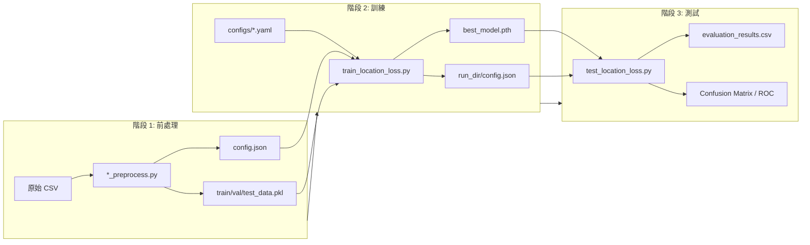
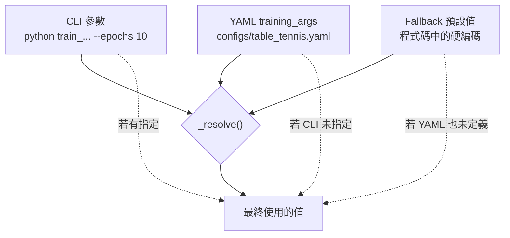
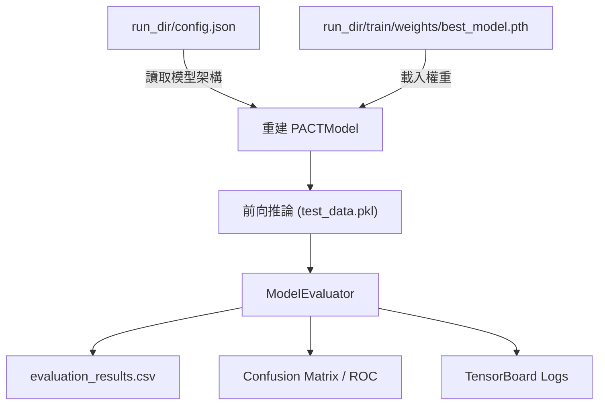
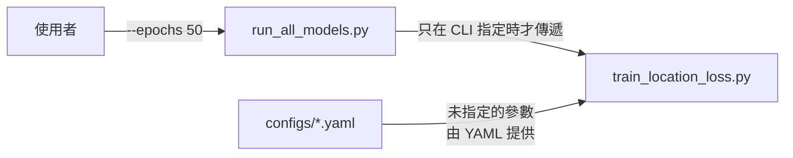

# PACT 拍類運動分析框架 (PACT Racket Sports Analysis Framework)

這是一個專為拍類運動（桌球、羽球、網球）設計的深度學習軌跡與動作預測框架。
我們透過高度模組化、設定檔驅動 (Config-driven) 的架構，支援多維度的層級資料特徵擷取，並提供了一鍵式的模型訓練、評估與指標視覺化方案。

## 🎯 核心功能與特色

1. **多運動支援 (Multi-Sport Support)**
   透過 `configs/` 資料夾下的 YAML 設定檔，框架能動態調整每個運動的特徵定義與層級結構。
   - 支援 3 層結構 (Shot → Rally → Set)：如桌球、羽球。
   - 支援 4 層結構 (Shot → Rally → Game → Set)：如網球。

2. **多任務預測與註冊表 (Multi-task Prediction & Task Registry)**
   不必將模型綁死在固定的預測目標上。透過 YAML 的 `targets:` 配置，您可以自由指定要預測的目標 (例如 `location`, `type`, `spin`, `backhand`)。
   `losses.py` 中的 `build_criterion_dict` 會自動為不同任務分派對應的 Loss 函數（例如標準 `CrossEntropyLoss` 或空間距離感知的 `DistanceWeightedCrossEntropyLoss`）。
   透過 YAML 中的 `use_distance_loss` 旗標可控制 `location` 任務是否啟用 `DistanceWeightedCrossEntropyLoss`（桌球啟用，網球與羽球使用標準 CE）。

3. **解耦的評估中心 (Independent Evaluator)**
   測試階段的指標計算被完全抽離至 `utils/evaluator.py` 中的 `ModelEvaluator` 類別。
   - 自動產出各種任務的 `.csv` 測試報告。
   - 自動繪製並儲存 ROC 曲線、混淆矩陣 (Confusion Matrices)。
   - 獨立的 `GridDistanceCalculator` 來計算基於網格的空間誤差 (Loc Dist)。

4. **基線模型適配器 (Baseline Model Adapter)**
   透過 `utils/base_model.py`，您可以輕易地將外部模型 (例如 LSTM、XGBoost 或其他 Transformer) 接入訓練流程。這些基線模型只需要繼承 `BaseModel` 並實作 `extract_features()`，即可直接享有我們強大的 `DataLoader` 和多任務預測頭評估套件。

---

## 🏗️ 目錄架構說明

```text
antigravity/
├── configs/                      # ⚙️ 運動專屬的超參數與特徵定義 (YAML)
│   ├── table_tennis.yaml
│   ├── badminton.yaml
│   └── tennis.yaml
│
├── src/                          # 💻 核心程式碼
│   ├── models/                   # 模型結構定義
│   │   ├── model_fuse.py         # 核心 PACT-iTransformer 架構群
│   │   └── baseline_lstm.py      # 基於 BaseModel 實作的 Bi-LSTM 範例
│   ├── model_components.py       # Transformer Encoding 與 Fusion 元件
│   ├── dataloader.py             # 統一的資料讀取工廠與 DataLoader
│   ├── default_config.py         # 讀取 YAML 與派發 Model Registry 的中樞
│   └── losses.py                 # Loss 函數定義與註冊表
│
├── utils/                        # 🔧 輔助與抽離工具
│   ├── evaluator.py              # 指標計算與視覺化中心
│   └── base_model.py             # 提供自訂 Baseline 套用的抽象層
│
├── scripts/                      # 🚀 執行腳本
│   ├── train_location_loss.py    # 單一模型訓練腳本
│   ├── test_location_loss.py     # 單一模型測試腳本
│   ├── run_all_models.py         # 一鍵訓練/測試的自動化批次執行器
│   └── diagnose_adaln.py         # AdaLN 診斷工具
│
├── preprocessing/                # 🔄 資料前處理腳本
│   ├── TableTennis_preprocess.py
│   ├── Badminton_preprocess.py
│   └── Tennis_preprocess.py
│
├── data/                         # 📁 資料集 (CSV + 前處理產出)
│   ├── table_tennis/
│   ├── badminton/
│   └── tennis/
│
├── outputs/                      # 📊 實驗輸出
│   ├── results/                  # 模型訓練/測試結果
│   └── 實驗記錄/
│
├── .gitignore
└── README.md
```

---

## 📋 端到端完整流程

整個框架從資料前處理到產出評估報告分為三個階段：



---

### 階段 1：資料前處理

每個運動都有獨立的前處理腳本，負責將原始 CSV 轉換為模型所需的階層式結構。

```bash
# 從專案根目錄執行
python preprocessing/TableTennis_preprocess.py   # 桌球
python preprocessing/Badminton_preprocess.py      # 羽球
python preprocessing/Tennis_preprocess.py         # 網球
```

**前處理腳本會產出：**

| 檔案 | 說明 |
|------|------|
| `config.json` | 資料描述檔：特徵列表、各類別數量 (`num_type`, `num_players` 等)、序列長度上限、資料分割 ID |
| `train_data.pkl` | 訓練集 (階層式結構的 Python 物件) |
| `val_data.pkl` | 驗證集 |
| `test_data.pkl` | 測試集 |
| `player_map.json` | 球員名稱 ↔ ID 對照表 |

> **注意**：`config.json` 只包含**資料層面**的資訊，**不包含**訓練超參數（`epochs`, `learning_rate` 等）。訓練超參數定義在 YAML 中。

---

### 階段 2：模型訓練

#### 設定檔優先級

訓練時所有超參數遵循以下優先級：

```
CLI 參數 (--epochs 10)  >  YAML 設定 (configs/*.yaml)  >  程式碼 Fallback 預設值
```



#### 設定檔分工

| 設定來源 | 內容 | 範例 |
|---------|------|------|
| **`config.json`** (前處理) | 資料描述、類別數量、分割 ID | `num_type: 20`, `num_players: 83`, `test_match_ids: [...]` |
| **`configs/*.yaml`** | 特徵定義、預測目標、Loss 權重、階層設定、訓練超參數 | `targets`, `embedding_dims`, `training_args`, `hierarchy_levels` |
| **CLI 參數** | 即時覆寫 (最高優先級) | `--epochs 10 --batch_size 64` |

#### 訓練指令

```bash
# 從專案根目錄執行

# 基本用法：使用 YAML 預設值訓練
python scripts/train_location_loss.py --model_type task_attention --sport table_tennis

# 覆寫特定超參數
python scripts/train_location_loss.py --model_type task_attention --sport table_tennis \
    --epochs 50 --learning_rate 0.0005 --batch_size 64

# 訓練其他運動
python scripts/train_location_loss.py --model_type parallel --sport badminton
python scripts/train_location_loss.py --model_type task_attention --sport tennis
```

#### 訓練參數一覽

| 參數 | 說明 | YAML 預設 (桌球) | Fallback |
|------|------|:---:|:---:|
| `--model_type` | 模型架構 | — | `task_attention` |
| `--sport` | 運動類型 | — | `table_tennis` |
| `--epochs` | 訓練輪數 | `40` | `40` |
| `--batch_size` | 批次大小 | `128` | `128` |
| `--learning_rate` | 學習率 | `0.0001` | `0.0001` |
| `--lambda_dist` | 距離 Loss 權重 | `1.0` | `1.0` |
| `--label_smoothing` | Label Smoothing | `0.1` | `0.1` |
| `--grid_offset` | Grid 起始索引 | `2` | `2` |
| `--use_distance_loss` (YAML only) | 桌球:`true` / 網球,羽球:`false` | `true` |
| `--weight_decay` | AdamW Weight Decay | — | `0.01` |
| `--warmup_ratio` | LR Warmup 比例 | — | `0.1` |
| `--num_workers` | DataLoader workers | — | `4` |
| `--d_model` | Transformer 維度 | — | `128` |
| `--nhead` | 注意力頭數 | — | `4` |
| `--num_encoder_layers` | Encoder 層數 | — | `2` |
| `--dim_feedforward` | FFN 維度 | — | `256` |
| `--dropout` | Dropout 比例 | — | `0.3` |
| `--clip` | 梯度裁剪值 | — | `1.0` |
| `--seed` | 隨機種子 (可重現性) | `42` | `42` |
| `--loss_weights` | 任務 Loss 權重 (JSON) | YAML `loss_weights` | 各任務等權 |
| `--use_rlw` | 啟用 Random Loss Weighting | — | `False` |
| `--use_skip_connection` | 啟用單拍 Skip Connection (相容舊版) | — | `False` |
| `--skip_window_size` | Skip Connection 聚合窗格 (0=關閉, 1=單拍, >1=多拍) | — | `0` |
| `--use_gated_fusion` | 啟用 PACT-iTransformer 門控雙路融合 | — | `False` |
| `--use_shot_aware_pe` | 啟用 Shot-Aware PE (注入發球/我方拍語義) | — | `False` |
| `--pooling_type` | 序列聚合策略 (`last`/`mean`/`attention`) | — | `last` |
| `--head_depth` | 預測頭 MLP 深度 (1=Linear, 2+=MLP) | — | `1` |

#### 訓練輸出目錄結構

```text
outputs/results/{sport}/run_{sport}_{model_type}_{YYYYMMDD_HHMMSS}/
├── config.json              # 完整設定快照 (含所有 resolved 後的參數)
└── train/
    ├── weights/
    │   ├── best_model.pth   # 驗證 Loss 最佳的權重
    │   └── last_model.pth   # 最後一個 Epoch 的權重
    └── logs/                # TensorBoard 日誌
```

> **重要**：`run_dir/config.json` 是訓練時的**完整快照**，包含所有已 resolved 的參數（資料描述 + YAML + CLI），測試腳本會讀取此檔案來還原模型。

---

### 階段 3：模型測試

測試腳本從 `run_dir/config.json` 讀取完整設定，確保模型架構與訓練時完全一致。

```bash
# 從專案根目錄執行

# 測試指定的訓練結果
python scripts/test_location_loss.py \
    --run_dir outputs/results/table_tennis/run_table_tennis_task_attention_20260222_172941 \
    --sport table_tennis

# 覆寫 Lambda Distance 進行消融分析
python scripts/test_location_loss.py \
    --run_dir outputs/results/table_tennis/run_table_tennis_task_attention_20260222_172941 \
    --sport table_tennis --lambda_dist 0.5
```

#### 測試輸出目錄結構

```text
outputs/results/{sport}/run_{sport}_{model_type}_{YYYYMMDD_HHMMSS}/
└── test/
    ├── evaluation_results.csv   # 所有任務的量化指標
    ├── evaluation_results.txt   # 人類可讀的文字報告
    ├── logs/                    # TensorBoard 日誌
    └── plots/
        ├── Type_Confusion_Matrix.png
        ├── Location_Confusion_Matrix.png
        ├── Type_ROC_Curve.png
        └── ...
```

#### 測試流程



---

### 一鍵批次執行 (run_all_models.py)

如果您希望一次性訓練並比較所有模型變體，可以使用批次執行器。

```bash
# 從專案根目錄執行

# 訓練並測試所有 5 種 PACT 模型（使用 YAML 預設參數）
python scripts/run_all_models.py --sport table_tennis

# 只跑特定模型
python scripts/run_all_models.py --sport table_tennis --models task_attention L1

# 覆寫訓練參數（會傳遞給 train_location_loss.py）
python scripts/run_all_models.py --sport table_tennis --epochs 50 --batch_size 64

# 跳過訓練，只對已訓練的模型執行測試
python scripts/run_all_models.py --sport table_tennis --skip_train

# 只訓練，不測試
python scripts/run_all_models.py --sport table_tennis --skip_test
```

#### 批次執行器的參數轉遞機制



- 所有超參數在 `run_all_models.py` 中 **預設為 `None`**
- 只有使用者明確指定的參數才會傳遞給 `train_location_loss.py`
- 未指定的參數由 `train_location_loss.py` 自行從 YAML 讀取

#### 批次執行輸出

```text
outputs/results/{sport}/
├── run_{sport}_parallel_{timestamp}/
├── run_{sport}_task_project_{timestamp}/
├── run_{sport}_task_attention_{timestamp}/
├── run_{sport}_L1_L2_{timestamp}/
├── run_{sport}_L1_{timestamp}/
└── results_summary.csv            # 所有模型的指標彙總表
```

---

## 🧠 模型架構 (Model Architectures)

本框架於 `src/default_config.py` 的 `MODEL_REGISTRY` 中內建了以下模型架構設定：

### PACT 網路家族 (`src/models/model_fuse.py`)
利用 Transformer Encoder 擷取序列資訊並針對階層特徵融合的多任務預測。

| 模型名稱 | 階層 | Fusion 方式 | 說明 |
|---------|------|------------|------|
| `L1` | Shot only | CLS Token | 只用擊球層級特徵的輕量化模型 |
| `L1_L2` | Shot + Rally | CLS Token | 兩階層模型 |
| `parallel` | 全階層 (依運動自動適配) | CLS Token | 所有階層特徵並發融合 |
| `task_project` | 全階層 (依運動自動適配) | Task Projection | 融合後為每個任務加專屬線性投影 |
| `task_attention` | 全階層 (依運動自動適配) | Task Attention | 以任務 Query Token 透過 Cross-Attention 提取 |

### 基線模型 (`baseline_lstm.py`)
| 模型名稱 | 說明 |
|---------|------|
| `baseline_lstm` | 雙向 LSTM (Bi-LSTM) 基線，示範 `BaseModel` 適配器用法 |

### 進階架構調整

以下參數可透過 CLI 控制模型的序列聚合策略與預測頭深度：

#### 序列聚合策略 (`--pooling_type`)

控制各階層 Encoder 如何將整段序列壓縮成一個向量，再送入 Fusion Module：

| 策略 | 做法 | 適用場景 |
|------|------|----------|
| `last` (預設) | 取序列最後一個有效時間步的 hidden state | Transformer 的 self-attention 已將全序列資訊聚集到最後一步，適用於大多數情境 |
| `mean` | 對所有有效時間步做 Masked Mean Pooling | 序列較長且各時間步同等重要時 |
| `attention` | 使用可學習的 Query 向量做 Cross-Attention，自動選取重要時間步 | 序列中只有少數關鍵時間步決定結果時 |

> **注意**：只有各階層的**最終聚合**（送入 Fusion 前）會受此參數影響。中間層的 Shot→Rally、Rally→Game 聚合固定使用 `last`，確保中間層資訊傳遞的穩定性。

#### 預測頭深度 (`--head_depth`)

控制 `DynamicPredictionHead` 中每個任務分類器的深度：

| `head_depth` | 架構 |
|-------------|------|
| `1` (預設) | `Linear(d_model → num_classes)` — 單層線性分類器 |
| `2` | `Linear → GELU → Dropout → Linear` |
| `3` | `Linear → GELU → Dropout → Linear → GELU → Dropout → Linear` |

#### Random Loss Weighting (`--use_rlw`)

啟用後，每個 training step 從 `N(0,1) + Softmax` 隨機生成任務 Loss 權重，取代 YAML 中的固定權重。驗證時仍使用固定權重，確保評估公平。

#### Multi-Shot Skip Connection (`--skip_window_size`)

結合 Skip Connection 與局部時間窗格 (Temporal Window) 的聚合技術。透過指定 `--skip_window_size N`，模型會截取「最後 N 拍」的原始特徵（尚未經過 Transformer 編碼），並對它們進行 Masked Mean Pooling。這個聚合後的向量會透過一個可學習的 Sigmoid Gate，動態注入到 Fusion 模組的輸出中。
- `0` = 關閉 (預設)
- `1` = 單拍 Skip Connection (只取最後一拍)
- `3` / `5` = 多拍池化，能為預測頭提供更穩定的「局部戰術脈絡」（如球速趨勢、位移方向），彌補 Transformer 在極短時間窗內的過度抽象問題。

#### Gated PACT-iTransformer Fusion (`--use_gated_fusion`)

原本 PACT (時間因果路徑) 與 iTransformer (變數特徵路徑) 的融合方式為靜態拼接 (`torch.cat`) 再降維。啟用此參數後，各層級 (L1 到 L4) 會全面替換為**動態門控融合 (Dynamic Sigmoid Gated Fusion)**。模型會根據當前的局面特徵，動態計算出一個 $0 \sim 1$ 之間的比例 $g$，並以此比例混合兩條路徑的決策，強化對不同戰術情境的適應力。

#### Shot-Aware Positional Encoding (`--use_shot_aware_pe`)

標準的 sinusoidal 位置編碼只知道「第幾拍」，不知道「這是發球還是接發球」「這是我方打的還是對手打的」。啟用後，模型會在 L1 Shot Encoder 中額外疊加兩個可學習的語義嵌入：
- **is_serve**：序列中第 0 拍 = 發球
- **is_self**：每一拍的 `player_id` 與目標球員相同 = 我方拍

這讓模型能明確區分「主動進攻」與「被動回應」的不同決策空間，且僅增加 512 個參數 (2 × `nn.Embedding(2, 128)`).

#### 使用範例

```bash
# 開啟多拍 Skip Connection (取最後 3 拍)
python scripts/train_location_loss.py --sport table_tennis --model_type task_attention --skip_window_size 3

# 開啟門控雙路融合
python scripts/run_all_models.py --sport table_tennis --use_gated_fusion

# 開啟 Shot-Aware PE
python scripts/run_all_models.py --sport table_tennis --use_shot_aware_pe

# 同時疊加多種進階架構優化
python scripts/train_location_loss.py --sport table_tennis --model_type task_attention \
    --use_shot_aware_pe \
    --use_gated_fusion
```

---

## 🛠️ 添加新的自訂模型 (How to add a new model)

要為本框架引入新演算法，只需經過以下三步驟：

1. **實作模型邏輯**: 在 `src/models/` 建立一個新檔案 (如 `src/models/my_new_model.py`)。繼承自 `utils.base_model.BaseModel`，並實作 `extract_features(batch)` 方法，需回傳 `(Batch, Feature_Dim)` 的特徵張量。
2. **建構預測頭**: 在您的 `__init__` 最後面調用 `self.build_task_heads(feature_dim=您的維度)`，框架會自動為您掛載目前需要預測的分類層。
3. **加入註冊表**: 在 `src/default_config.py` 的 `MODEL_REGISTRY` 新增一個 key 連結至您的腳本。

```python
# src/default_config.py
MODEL_REGISTRY = {
    # ...,
    'my_custom': {
        'module': 'src.models.my_new_model',
        'class_name': 'MyNewModel',
        'config_overrides': {} 
    }
}
```
隨後，即可在終端執行 `python scripts/train_location_loss.py --model_type my_custom`！

---

## ⚙️ YAML 設定檔結構 (Config Reference)

每個運動的 YAML 設定檔 (`configs/*.yaml`) 包含以下區段：

```yaml
sport: table_tennis

# === 特徵定義 ===
features_to_extract: [...]       # 從 CSV 對應的欄位名稱
categorical_features: [...]      # 需要 Embedding 的類別特徵
numerical_features: [...]        # 直接使用的數值特徵
embedding_dims:                  # 各類別特徵的 Embedding 維度
  type: 16
  location: 16

# === 預測任務 ===
targets: [type, backhand, location, strength, spin]

# === Loss 權重 ===
loss_weights:                    # 各任務在總 Loss 中的權重
  type: 0.2
  location: 0.2

# === 階層配置 ===
hierarchy_levels: [L1, L2, L3]   # 3 層或 4 層 (網球: [L1, L2, L3, L4])

# === 序列長度上限 ===
max_shot_seq_len: 60
max_rally_seq_len: 50
max_set_seq_len: 3

# === 資料路徑 ===
data_dir: data/table_tennis/processed_data
config_file: data/table_tennis/processed_data/config.json
results_dir: outputs/results/table_tennis

# === 訓練超參數 (CLI 未指定時使用) ===
training_args:
  epochs: 40
  batch_size: 128
  learning_rate: 0.0001
  label_smoothing: 0.1
  lambda_dist: 1.0
  grid_offset: 2
  use_distance_loss: true            # location 任務是否啟用距離加權 Loss
  seed: 42                           # 隨機種子，確保可重現性
```

---

## 🔁 可重現性 (Reproducibility)

本框架在訓練階段內建了完整的隨機種子控制，涵蓋以下隨機源：

| 隨機源 | 控制方式 |
|--------|----------|
| Python `random` | `random.seed(seed)` |
| NumPy | `np.random.seed(seed)` |
| PyTorch CPU | `torch.manual_seed(seed)` |
| PyTorch CUDA | `torch.cuda.manual_seed_all(seed)` |
| cuDNN | `deterministic=True`, `benchmark=False` |
| 資料分割 (Preprocessing) | `train_test_split(random_state=seed)` |

### 使用方式

`seed` 遵循與其他參數相同的優先級：**CLI > YAML > Fallback (42)**

```bash
# 方式 1: CLI 指定 (最高優先)
python scripts/train_location_loss.py --model_type task_attention --sport table_tennis --seed 123

# 方式 2: 在 YAML 中設定 (configs/table_tennis.yaml)
# training_args:
#   seed: 42

# 方式 3: 不指定 → 自動使用預設值 42
python scripts/train_location_loss.py --model_type task_attention --sport table_tennis
```

訓練完成後，使用的 `seed` 值會被記錄在 `run_dir/config.json` 的 `training_args.seed` 中，方便日後復現。
